# CleaningVk

## Перед началом работы

Для работы с этой программой вам потребуется сгенерировать `access token`. Чтобы сделать это, нужно адресную строку браузера вставить ссылку следущего формата:

> `https://oauth.vk.com/authorize?client_id=%client_id%&display=page&redirect_uri=https://oauth.vk.com/blank.html&scope=%scope%&response_type=token&v=%api_version%`

> * `%client_id%` - идентификатор Standalone-приложения;
> * `%scope%` - разделы странички пользователя, к которым можно будет получить доступ, используя полученный access token;
> * `%api_version%` - используемая версия VK API.

Чтобы получить `client_id`, нужно создать свое Standalone-приложение. Для этого переходим по [ссылке](http://vk.com/apps?act=manage).

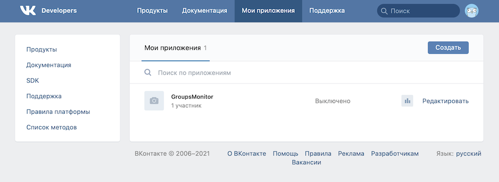

Далее жмем на кнопку «Создать». Откроется страничка создания приложения. 

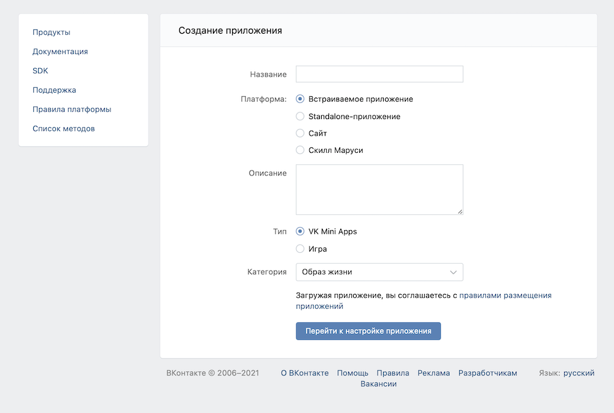

Здесь необходимо выбрать платформу «Standalone-приложение» и ввести свое название для приложения.

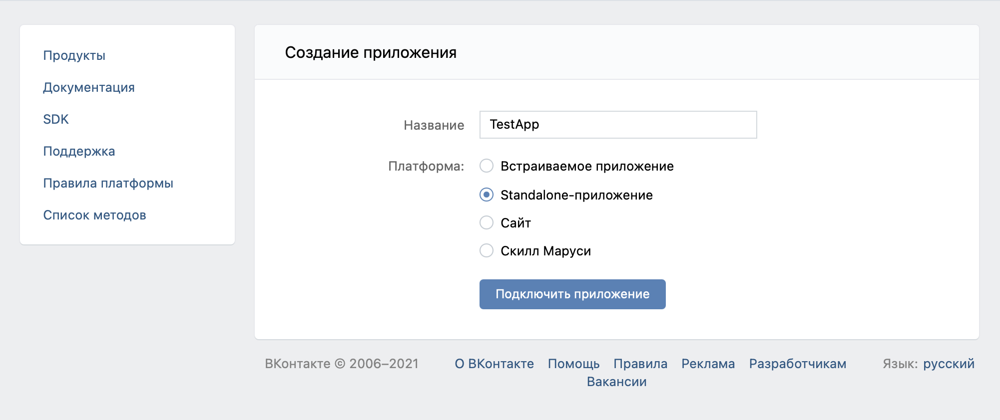

После ввода кода подтверждения от ВК приложение будет создано.

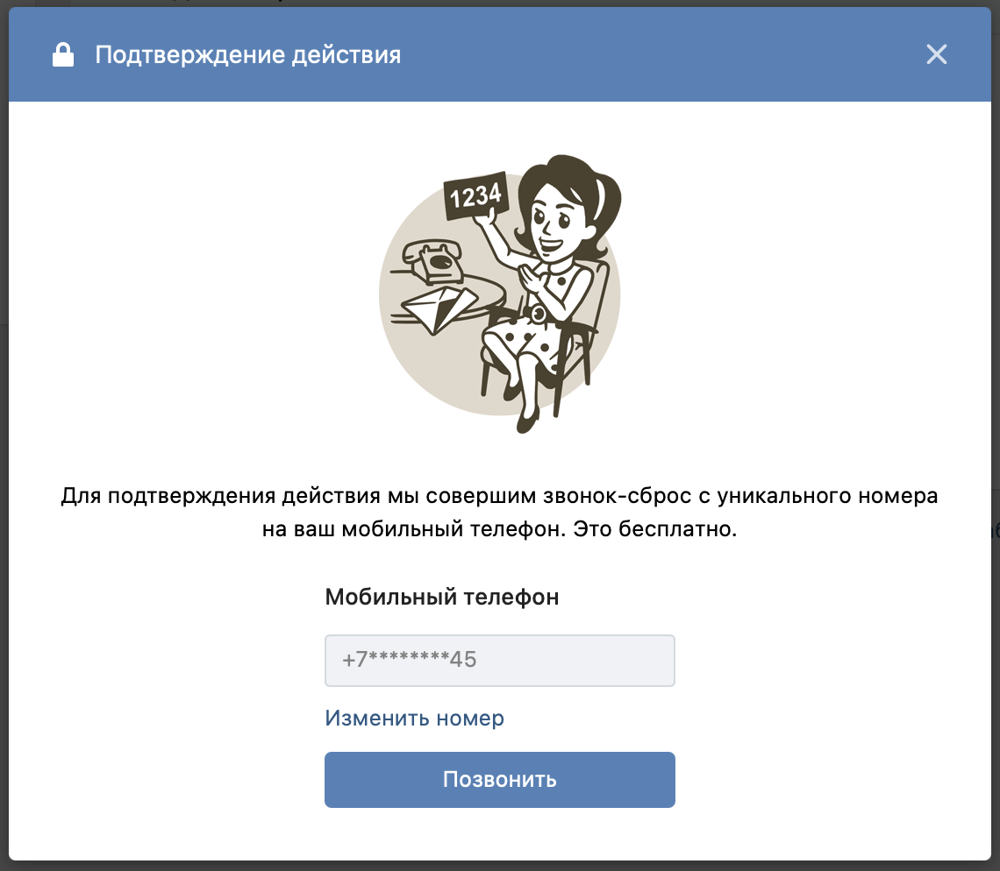

Откроется страничка с параметрами нового приложения.

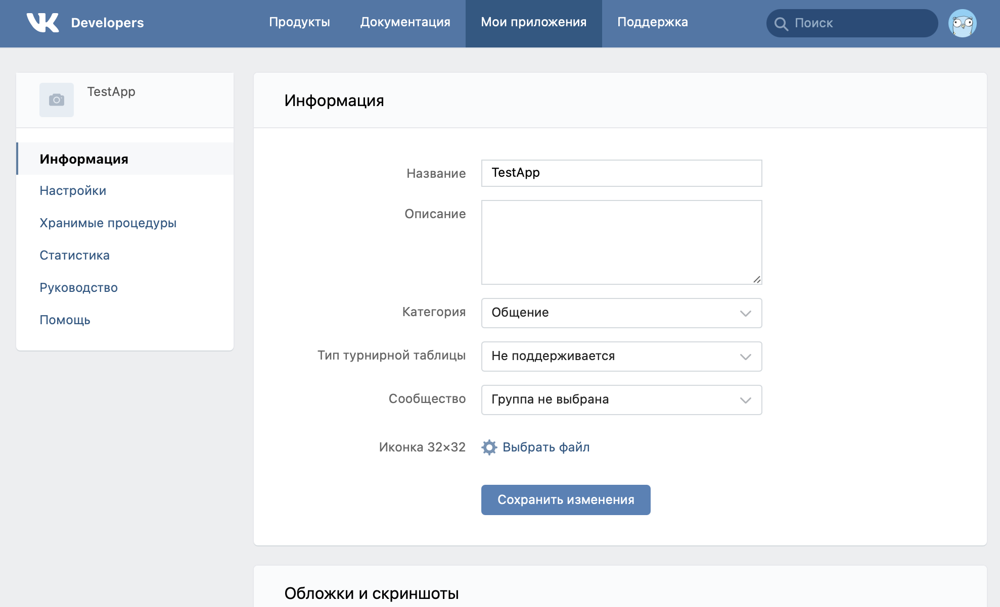

Далее переходим в раздел «Настройки».

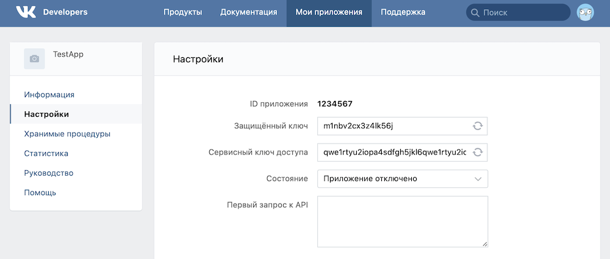

«ID приложения» - это и есть наш `client_id`, необходимый для создания ссылки на получение `access token`. Копируем его и вставляем вместо `%client_id%`.

> `https://oauth.vk.com/authorize?client_id=1234567&display=page&redirect_uri=https://oauth.vk.com/blank.html&scope=%scope%&response_type=token&v=%api_version%`

Вместо `%scope%` нужно вставить строку с перечислением разделов, к которым программе необходимо получить доступ. Для корректной работы нужны следующие права: `groups`, `wall`.

> `https://oauth.vk.com/authorize?client_id=1234567&display=page&redirect_uri=https://oauth.vk.com/blank.html&scope=groups,wall&response_type=token&v=%api_version%`

Вместо `%api_version%` нужно указать версию используемого VK API. Так как минимальная версия, используемая в программе - `5.68`, укажем ее.

> `https://oauth.vk.com/authorize?client_id=1234567&display=page&redirect_uri=https://oauth.vk.com/blank.html&scope=groups,wall&response_type=token&v=5.68`

Теперь полученную вами ссылку можно вставлять в строку браузера. Однако, если вы просто скопируете ссылку из этого руководства, то у вас ничего не получится, поскольку данный `client_id` указан для примера и не является валидным. Вам необходимо вместо цифр `1234567` вставить `client_id` своего Standalone-приложения.

После перехода по ссылке ВК выведет запрос разрешения на доступ к указанным разделам странички.

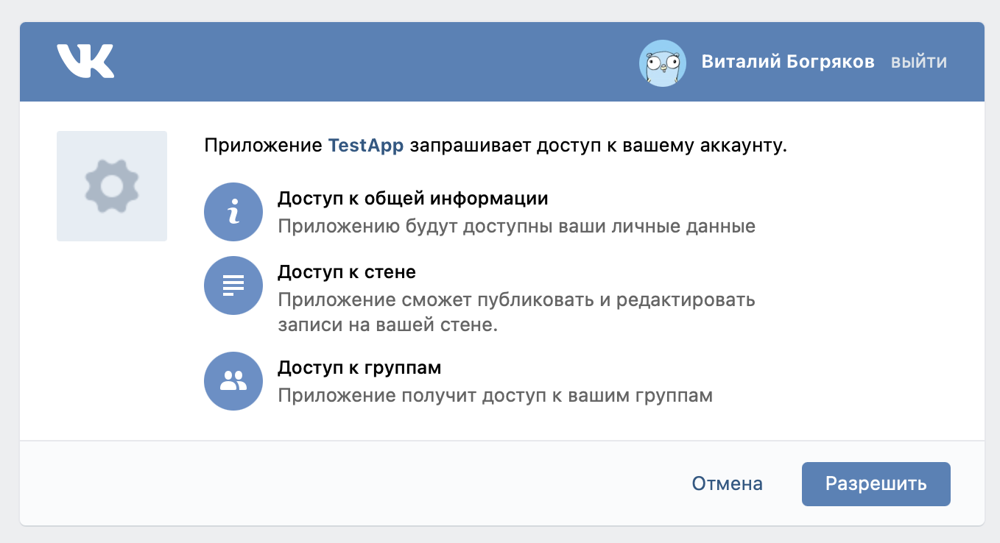

После нажатия на кнопку «Разрешить» откроется следующая страничка.

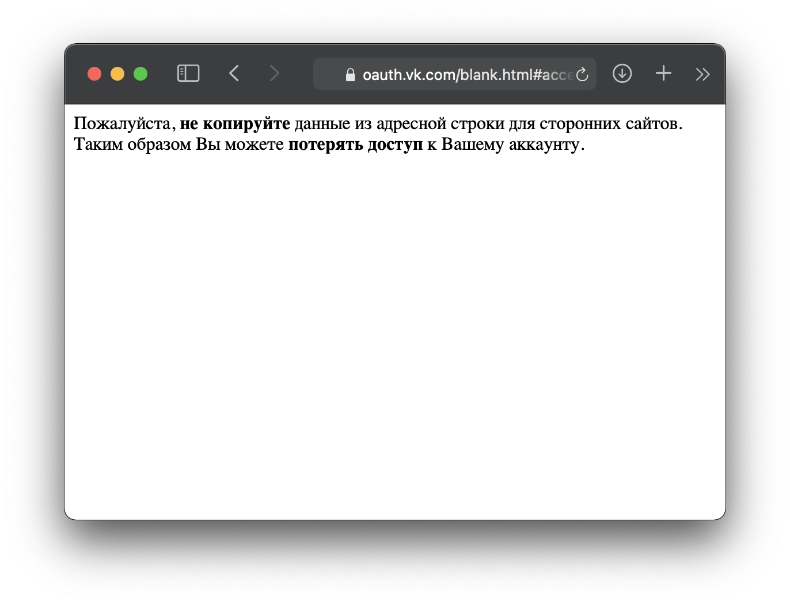

Полученный access token можно скопировать из адресной строки браузера.

> `https://oauth.vk.com/blank.html#access_token=a1sd2fghj3k4l5oiu6yzxc7vba1sd2fghj3k4l5oiu6yzxc7vba1sd2fghj3k4l5oiu6yzxc7vb&expires_in=86400&user_id=43211234`

В данной ссылке это `a1sd2fghj3k4l5oiu6yzxc7vba1sd2fghj3k4l5oiu6yzxc7vba1sd2fghj3k4l5oiu6yzxc7vb`

Он действует 24 часа и привязан к IP-адресу, поэтому спустя сутки или при подключении к новой точке доступа access token придется генерировать заново таким же образом.

## Работа с программой

Так как это программа с консольным пользовательским интерфейсом, запускать ее нужно из терминала.

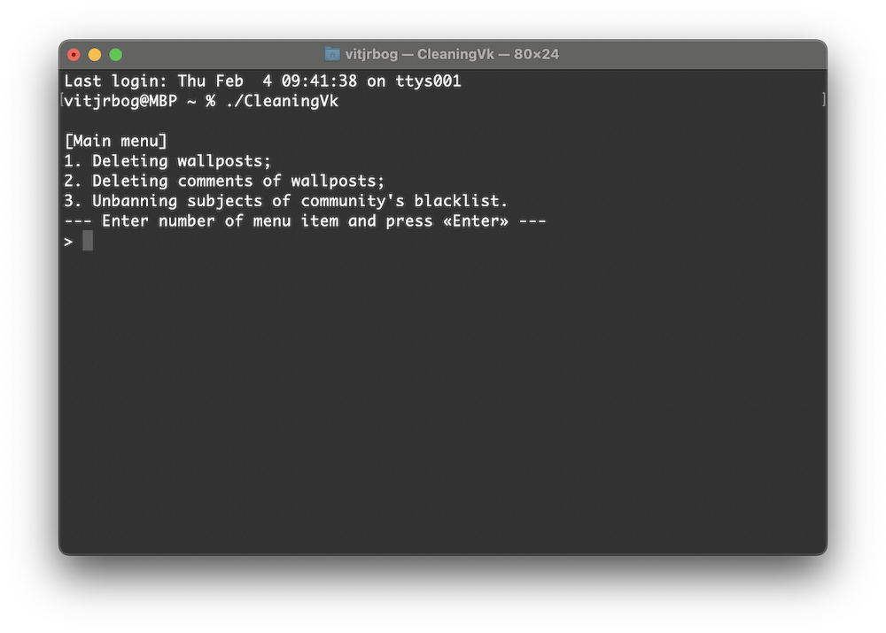

В главном меню пользователь видит перечисленные функции программы:

1. удаление постов на стене;
2. удаление комментариев под постами на стене;
3. очистка черного списка сообщества.

Для выбора следует ввести номер соответствующей функции и нажать Enter. Для примера рассмотрим удаление постов со стены.

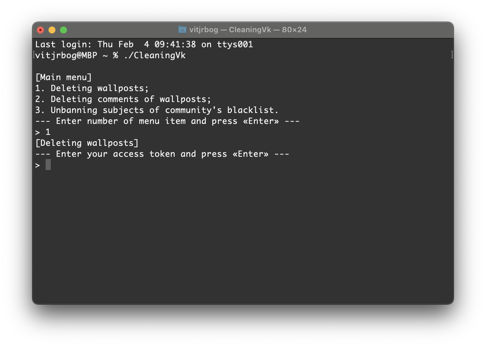

Далее программа запросит access token. Вставляем (или вводим вручную, как понравится) и нажимаем Enter.

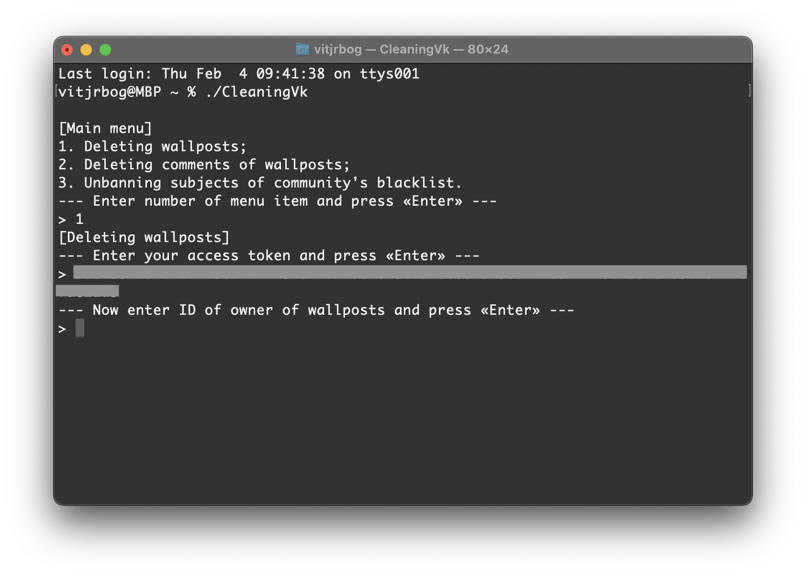

Далее необходимо будет ввести `id` странички пользователя или сообщества ВК, где будет выполняться удаление постов. Обратите внимание, что `id` сообщества должен быть со знаком «минус», иначе ВК интерпретирует его, как `id` странички пользователя.

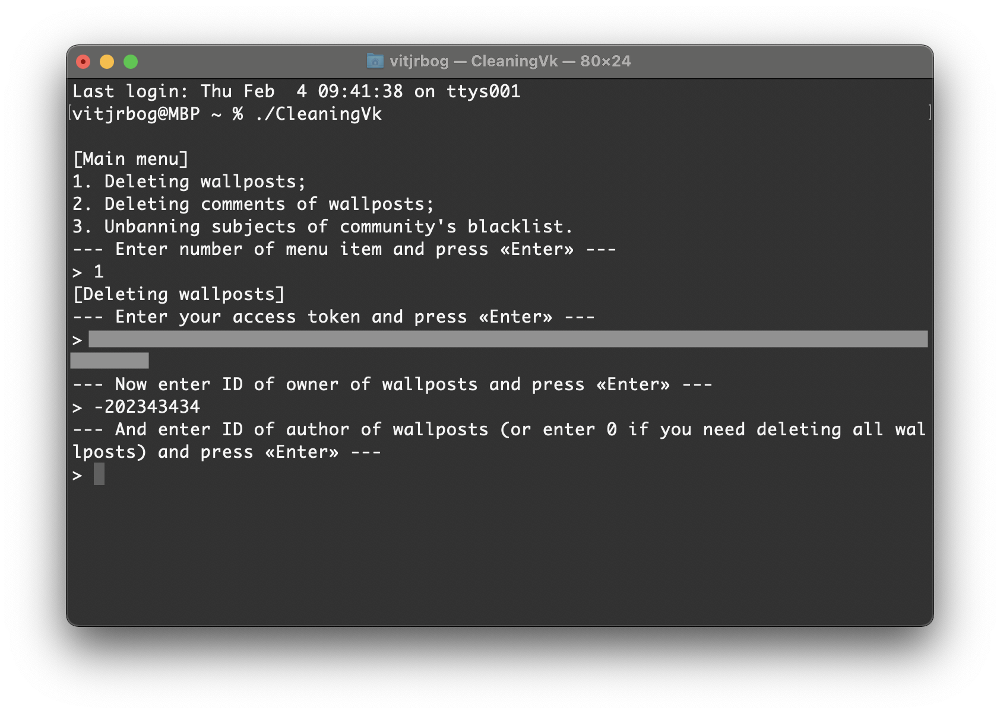

Следующим действием будет ввод `id` автора постов, которые нужно удалить. Для удаления всех постов со стены нужно ввести число `0` и нажать Enter.

В ходе работы программа будет выводить ссылки на удаленные посты. Если постов много, то операция займет некоторое время, поэтому придется набраться терпения и дождаться окончания очистки.

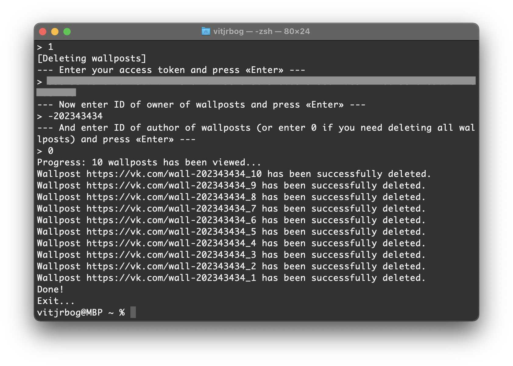

Для функции удаления комментариев алгоритм взаимодействия с программой аналогичный. 

Теперь рассмотрим процесс очистки черного списка сообщества. Первые два этапа - выбор функции и ввод access token - аналогичны вышеописанным, поэтому их опустим. 

Далее программа попросит ввести `id` сообщества, где необходимо провести чистку. Обратите внимание, что в данном случае `id` сообщества должен быть **БЕЗ** знака «минус» (`-`), иначе программа упадет с ошибкой.

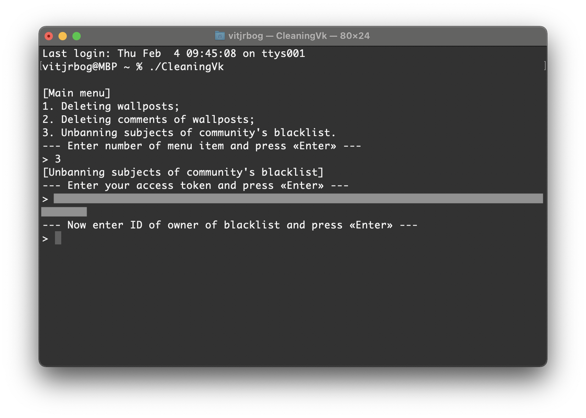

Как и при удалении постов со стены, при очистке черного списка в терминал будут выводиться ссылки на разблокированных пользователей. Если заблокированных много, то процесс может занять некоторое время.

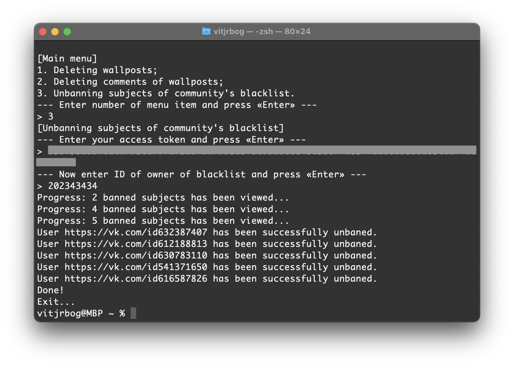